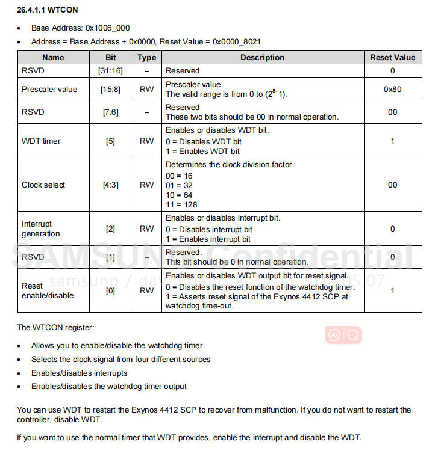

# WDT实验

## WDT简介
WDT(Watchdog Timer)，即看门狗定时器，是嵌入式系统中的一个常见组件，主要用于检测和恢复系统的故障。其工作原理很简单：一旦启动，WDT就开始倒计时，如果在规定的时间内没有被“喂食”或重新配置，它会认为系统出现了故障，并触发一个重启或其他故障恢复动作

### 工作原理
1. 初始化：  
首先，看门狗定时器需要被初始化。这通常包括设定超时时间、选择操作模式（例如重启或产生中断）等。
2. 计数：  
一旦启动，WDT开始递减其内部计数器或递增，取决于其设计。
3. 系统正常运行时：  
在正常运行时，系统会在看门狗定时器超时之前周期性地“喂狗”。这通常意味着写一个特定的值或执行一个特定的操作来重置WDT的计数器，这样它就不会超时。

4. 系统故障时：  
如果因为软件错误或其他问题导致系统挂起或不能按时“喂狗”，WDT计数器会达到0或达到其最大值。

5. 超时响应：  
当WDT超时时，它可以被配置为执行多种操作，最常见的是硬重启。这通过硬件触发系统复位来实现，确保系统能从任何悬挂或错误状态中恢复。在某些系统中，WDT可以被配置为首先触发一个中断，给软件一个恢复错误的机会，如果软件不能在一个较短的时间内响应，WDT则会触发硬重启。

### 为什么使用WDT
- 系统恢复：  
WDT是一个自动的故障恢复机制，确保系统可以从临时错误中恢复，而无需人为干预。

- 减少停机时间：  
对于关键应用，如医疗设备、汽车控制系统等，减少由软件错误或硬件故障引起的停机时间是至关重要的。

- 增加可靠性：  
尽管WDT不是解决软件错误的方法，但它确保了即使在出现错误时，系统也能继续运行或快速恢复。

## Exynos4412下的WDT控制器


### 概述  
Exynos 4412 SCP中的看门狗定时器（WDT）是一个计时设备。您可以使用此设备在由于噪声和系统错误导致的故障后恢复控制器操作。您可以将WDT用作正常的16位间隔计时器来请求中断服务。WDT生成复位信号。
### WDT的特点  
WDT的特点包括：
- 支持带有中断请求的正常间隔计时器模式。
- 如果计时器计数值达到0（超时），则激活内部复位信号。
- 支持电平触发的中断机制。


### 功能描述
此部分包括：

- WDT操作
- WTDAT和WTCNT
- WDT启动
- 考虑调试环境

#### WDT操作
- WDT使用PCLK作为其源时钟。8位预分频器预先分配PCLK频率以生成相应的WDT，并再次划分所得频率。  
- 图26-1展示了WDT的功能块图
- 看门狗定时器控制 (WTCON) 用来指定预分频器的值和频率分割因子。有效的预分频值范围从0到(2^8-1)你可以选择频率分割因子为：16、32、64或128。
- 使用以下公式来计算WDT时钟频率和每个定时器时钟周期的持续时间：  
t_watchdog = 1/(PCLK/(Prescaler value + 1)/Division_factor)


#### WTDAT 和 WTCNT  
启用 WDT 之后，您不能自动地将看门狗定时器数据（WTDAT）寄存器的值重新加载到看门狗定时器计数器（WTCNT）寄存器中。因此，您必须在 WDT 启动之前向 WTCN 寄存器写入一个初始值。
#### WDT 启动
要启动 WDT，将 WTCON[0] 和 WTCON[5] 设置为 1。
#### 考虑调试环境
如果 Exynos 4412 SCP 处于使用嵌入式在线调试器（ICE）的调试模式，WDT 不应该操作。
WDT 通过 CPU 核心信号（DBGACK 信号）确定 CPU 核心是否当前处于调试模式。在 CPU 核心断言 DBGACK 信号之后，由于 WDT 过期，它不激活 WDT 的重置输出。
### WDT寄存器描述




## 实验要求
编程实现将WDT的递减频率设置为10000HZ，程序运行5s后开发板复位

### 程序流程
1. 设置一级分频（WTCON[15:8]）
2. 设置二级分频（WTCON[4:3]）
3. 设置是否产生中断信号（WTCON[2]）
4. 设置是狗产生复位信号（WTCON[0]）
5. 设置计时器初始值 （WTCNT）
6. 开始工作 （WTCON[5]）
7. 根据要求来决定是否喂狗（WTCNT）

### 程序
[点击这里查看完整的代码](./interface.c) 
```C
int main()
{
	WDT.WTCON = WDT.WTCON | (0x4D << 8); 	// 设置一级分频WTCON[15:8]
	WDT.WTCON = WDT.WTCON | (0X3 << 3); 	// 设置二级分频WTCON[4:3]
	/*WTCNT递减频率 = PLCK(100000000)/(0x4D + 1)/128 = 10016*/
	WDT.WTCON = WDT.WTCON & (~(1 << 2)); 	// 禁止WDT产生中断信号WTCON[2]
	/*实验要求减到零进行复位*/
	WDT.WTCON = WDT.WTCON | 1;				// 使能WDT产生复位信号WTCON[0]
	WDT.WTCNT = (10000 * 10);				// 设置计数器的初始值
	WDT.WTCON = WDT.WTCON | (1 << 5);		// 使能WDT,计数器开始递减
	
	while (1)
	{
		printf("WDT.WTCNT = %d\n", WDT.WTCNT);
		WDT.WTCNT = 10000; // 喂狗
		Delay(100000);
	}
	return 0;
}

void Delay(unsigned int Time)
{
	while(Time--);
}
```
